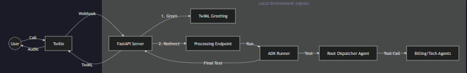

# Intelligent Voice Agent (IVR) with ADK

An enterprise-grade, conversational Voice Agent built with Google's **Agent Development Kit (ADK)**, **Twilio**, and **Redis**. This system replaces traditional button-mashing IVRs with a natural, human-like AI that can handle complex queries, execute real tools, and manage state persistently.



## ✨ Key Features

### 🧠 Intelligent Conversational Core
-   **Natural Language Routing**: The `RootDispatcher` understands user intent and dynamically routes calls to specialist agents (`Billing`, `TechSupport`, `Escalation`).
-   **Dynamic Context Injection**: Automatically detects the caller's identity (e.g., Phone Number) and "bakes" it into the AI's prompts, ensuring every tool call acts on the correct user account without asking for an ID.

### ⚡ Professional Voice UX
-   **Smart Fillers**: Context-aware latency masking.
    -   *User*: "Check my bill." -> *Agent*: "Checking your account details..."
    -   *User*: "I want a human." -> *Agent*: "Connecting you to an agent..."
-   **Instant Hangup**: Heuristically detects "Goodbye" or "Thanks" to terminate the call immediately, saving telephony costs and improving user satisfaction.
-   **TTS Optimization**: Special instructions ensure numbers (like Ticket IDs) are read out clearly (digit-by-digit) and repeated.

### 🛡️ Robust & Persistent Architecture
-   **Redis Database Integration**:
    -   **Persistence**: User profiles, balances, and network status are stored in a local Redis instance.
    -   **Atomic Transactions**: Safe balance updates using Redis transactions.
    -   **Ticket Management**: Escalations create persistent support tickets in the database.
-   **Thread-Safe Agent Factory**: A `create_agent_graph()` factory ensures every incoming call gets a fresh, isolated agent instance, preventing data leaks between concurrent callers.
-   **Resilience**: Implements retry logic for Twilio API calls and handles network interruptions gracefully.

---

## 🏗️ System Architecture

1.  **Telephony (Twilio)**: Handles the PSTN voice stream and sends webhooks to our server.
2.  **Server (FastAPI)**:
    -   **`/voice`**: Greets the user.
    -   **`/gather_speech`**: Receives STT (Speech-to-Text) and determines intent (Process or Hangup).
    -   **`/process_speech`**: Offloads work to a background task (Async) to prevent timeouts, playing "Hold Music" (Smart Fillers) to the user.
3.  **Brain (Google ADK)**: The `Runner` executes the Agent Graph, calling tools as needed.
4.  **Backend (Redis)**: The Source of Truth for all data.

---

## 🚀 Getting Started

### 1. Prerequisites
-   **Python 3.10+**
-   **Redis Server** (Running on `localhost:6379`)
-   **Twilio Account** & **ngrok**

### 2. Installation
```bash
pip install -r requirements.txt
```

### 3. Configuration
Create a `.env` file:
```ini
GOOGLE_API_KEY=your_gemini_key
TWILIO_ACCOUNT_SID=your_sid
TWILIO_AUTH_TOKEN=your_token
REDIS_URL=redis://localhost:6379/0
```

### 4. Running the System

**Step 1: Seed the Database** (Populates test user `+918275267982`)
```bash
python seed_db.py
```

**Step 2: Start the Server**
```bash
uvicorn server:app --port 8000 --reload
```

**Step 3: Expose to Twilio**
```bash
ngrok http 8000
```
*Update your Twilio Voice Webhook to: `https://<your-ngrok-url>/voice`*

---

## 🧪 Testing Scenarios

| Intent | What to say | Expected Behavior |
| :--- | :--- | :--- |
| **Billing** | "Check my balance." | Agent queries Redis and speaks the exact amount (e.g., "1245"). |
| **Network** | "Check for outage." | Agent checks `India-West` status in Redis and confirms outage. |
| **Escalation** | "I want to talk to a human." | Agent creates a generic Ticket in Redis and reads the Ticket ID digit-by-digit. |
| **Hangup** | "Thanks, bye." | Call ends immediately. |

---

## 📂 Project Structure

*   `server.py`: The FastAPI core handling the Voice lifecycle.
*   `agents/agent_factory.py`: Dynamically creates agents with user context.
*   `services/database.py`: Redis wrapper for data persistence.
*   `tools/`: Real implementation of `billing`, `network`, and `escalation` tools.
*   `prompts/`: System prompts with strict governance rules (Prompt Engineering).
